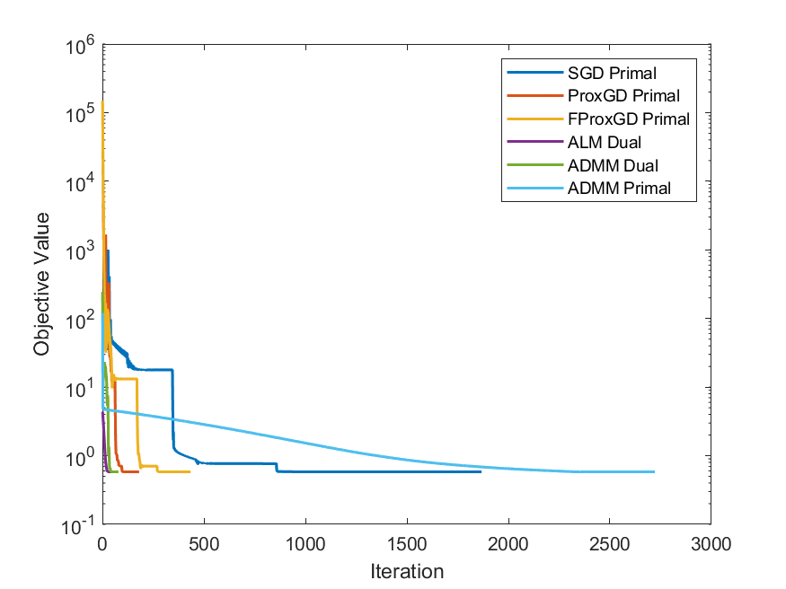

# PKU_Convex_Optimization_Final_Project_24
A Matlab implementation of the group LASSO problem at Optimization Methods taught by Zaiwen Wen at PKU, 24 Fall.

## Problem Formulation

Consider the group LASSO problem

```math
\min_{x\in\mathbb{R}^{n\times l}}\quad\frac{1}{2}\|Ax-b\|_F^2+\mu\|x\|_{1,2}
```

Here:

```math
\begin{align}
A&\in\mathbb{R}^{m\times n}\\
b&\in\mathbb{R}^{m\times l}\\
\mu&>0
\end{align}
```

and that

```math
\|x\|_{1,2}=\sum_{i=1}^n\|x(i,1:l)\|_2.
```

where $x(i,1:l),1\leq i\leq n$ is the $i$-th row of matrix $x$.

## Usage

1. Change the working dir to this repo
2. Add path to `helper_functions` in Matlab, and save path
3. Change the Gurobi/Mosek dir in `gl_gurobi.m`/`gl_mosek.m` to your own correspondingly
4. Run `Test_group_lasso.m`

## Result Overview



| Method         | CPU (s) | Iter | Optval      | Sparsity | Err-to-Exact | Err-to-CVX-Mosek | Err-to-CVX-Gurobi |
| -------------- | ------- | ---- | ----------- | -------- | ------------ | ---------------- | ----------------- |
| CVX-Mosek      | 3.16    | -1   | 5.80556E-01 | 0.103    | 3.75E-05     | 0.00E+00         | 1.08E-07          |
| CVX-Gurobi     | 0.65    | -1   | 5.80556E-01 | 0.103    | 3.75E-05     | 1.08E-07         | 0.00E+00          |
| Mosek          | 13.19   | -1   | 5.80556E-01 | 0.103    | 3.75E-05     | 8.15E-08         | 4.05E-08          |
| Gurobi         | 17.75   | -1   | 5.80556E-01 | 0.105    | 3.77E-05     | 3.80E-07         | 4.75E-07          |
| SGD Primal     | 0.68    | 1868 | 5.80559E-01 | 0.144    | 5.23E-05     | 1.84E-05         | 1.85E-05          |
| ProxGD Primal  | 0.08    | 181  | 5.80556E-01 | 0.103    | 3.75E-05     | 1.29E-07         | 2.75E-08          |
| FProxGD Primal | 0.10    | 434  | 5.80556E-01 | 0.103    | 3.74E-05     | 1.35E-07         | 2.99E-08          |
| ALM Dual       | 0.42    | 62   | 5.80568E-01 | 0.100    | 6.40E-05     | 3.23E-05         | 3.23E-05          |
| ADMM Dual      | 0.12    | 79   | 5.80568E-01 | 0.100    | 6.55E-05     | 3.23E-05         | 3.23E-05          |
| ADMM Primal    | 10.91   | 2721 | 5.80556E-01 | 0.103    | 3.75E-05     | 1.77E-07         | 1.28E-07          |

## Solver Description

Each solver is in `gl_(solver's name).m`  format, and all of them can be called separately by the following format:

```matlab
[x, iter, out] = gl_solver_name(x0, A, b, mu, opts)
```

Here:

- `x0`: initial solution
- `A ,b ,mu`: given parameters from the problem
- `opts`: a structure, containing input parameters for each solver. Check `(solver's name)_optsInit.m` for their default values
- `x`: final solution from the solver
- `iter`: iterations when `x` is outputed
- `out`: a structure, containing additional information of the solving process. Including:
  - `fval`: objective value at `x`
  - `iters`: a enumerated list of objective value at each step
  - Other informations specific for each solvers

## Reference

[repo: group-lasso-optimization](https://github.com/gzz2000/group-lasso-optimization)

[Matlab examples from class](http://faculty.bicmr.pku.edu.cn/~wenzw/optbook/pages/contents/contents.html)

[repo: Algorithms-group-LASSO-problem](https://github.com/AkexStar/Algorithms-group-LASSO-problem/tree/main)
